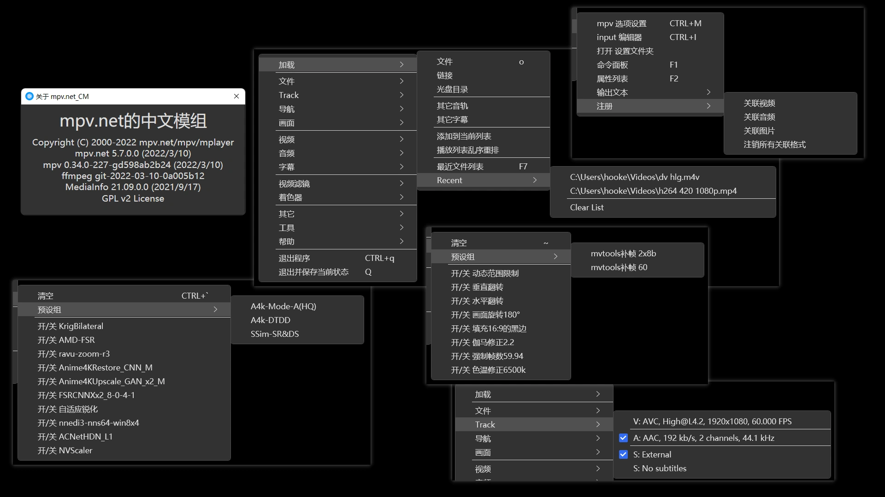
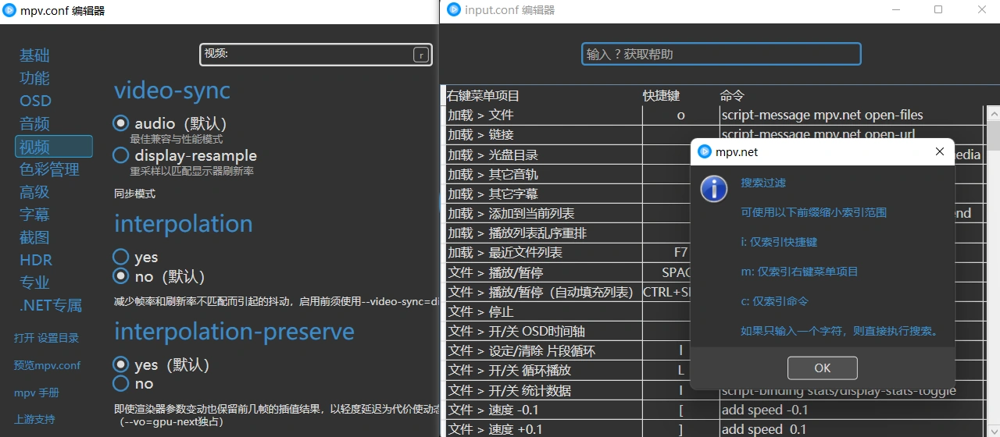
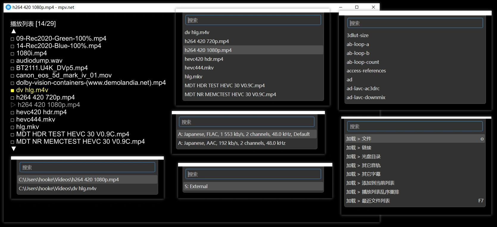
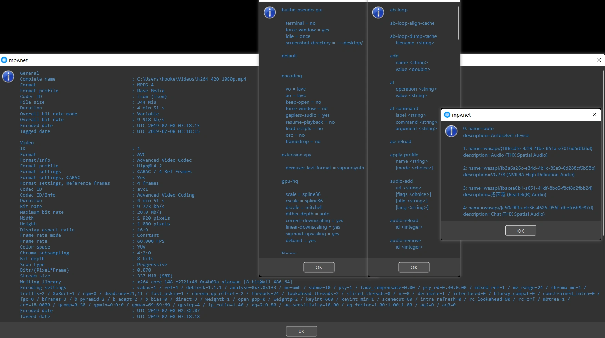
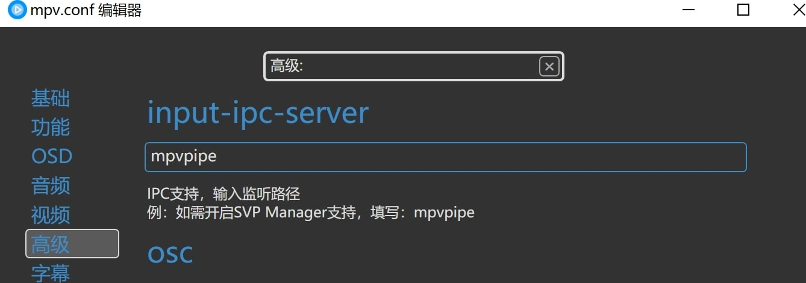
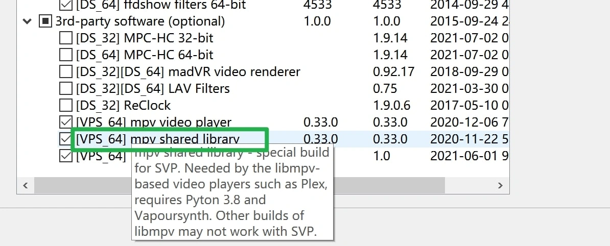

# 主页

此分支仅用作展示和说明


# 🎞 mpv.net_CM

mpv.net_CM 是基于上游的中文分支模组，原版mpv.net具有下列明显特点：

- 几乎所有mpv的功能都可用，除去一些窗口行为
- 兼容几乎所有mpv脚本/着色器，除去部分具有特定依赖的项目
- 单实例/多实例切换
- 支持基础操作的播放列表、音轨字幕轨列表面板
- 图形化的设置修改与快捷键编辑器
- 可自定义的右键菜单
- 音量、窗口尺寸的退出时记忆

本模组对上游项目如下变更：

- [x] 界面汉化
- [x] 编辑器选项修改
- [x] 菜单条目+初始快捷键修改
- [x] 集成Python+VapourSynth便携式组件
- [x] 预设脚本与着色器

操作习惯移植自 [mpv-lazy](https://github.com/hooke007/MPV_lazy) 。相比于前者，mpv.net_CM有更友好的界面操作性，更利于萌新上手，但某种程度上也限制了自由发挥。


## 极简的程序使用介绍

_本模组无需下载原版mpv.net_  
运行 mpvnet.exe 即可启动程序

需要用户已安装 **.NET framework 4.8 运行库** （win10 1903及之后版本的系统内已集成） [指路链接](https://support.microsoft.com/zh-cn/topic/%E9%80%82%E7%94%A8%E4%BA%8E-windows-%E7%9A%84-microsoft-net-framework-4-8-%E8%84%B1%E6%9C%BA%E5%AE%89%E8%A3%85%E7%A8%8B%E5%BA%8F-9d23f658-3b97-68ab-d013-aa3c3e7495e0)  
之前用过原版或者旧版的需要执行一次 **mpvnet注册表信息清理.reg**  
恢复默认设置可执行 **mpvnet设置重置与缓存清理.bat**  
mpvnet的 **libmpv内核** 可自行独立更新（替换文件目录中的 **mpv-2.dll** ）


## 下载

- 网页端右侧 [**Releases**](https://github.com/hooke007/mpv.net_CM/releases)
- 我的主页 [**网盘备份**](https://hooke007.github.io/#%E7%BD%91%E7%9B%98%E5%A4%87%E4%BB%BD) 

## 反馈

交流可以使用右上方网址。如果论坛无法进入可以在 [此处](https://github.com/hooke007/MPV_lazy/discussions) 发帖


## 预览

关于、多功能右键菜单  


图形化编辑器、快捷指令  


两类播放列表、多种操作面板  


富媒体信息、简易化的mpv指令查询  



## 更多说明

针对 一般用户---  
画面中右键，弹出所有可使用的选项。
呼出高级播放列表后, 上下左右操控条目，回车确定，退格清除。

针对 想要深度DIY的用户---  
设置重置与缓存清理会删除 mpv.conf 和 input.conf 文件；  
 mpv.conf 中的选项会被图形编辑器强制覆盖，所以尽可能从图形界面修改参数；  
无需 autoload.lua 脚本（功能重合）。 theme.conf 可实现主题配色自定义（自行备份）。 input.conf 可进行菜单自定义（自行备份）


### 右键菜单客制化

mpv.net拥有一个可自定义的右键菜单，只需简单修改 input.conf 文件即可。

与原版mpv的快捷键自定义相似，结构为 “键位   参数   #注释” （原版mpv的快捷键修改参考 [此处](https://hooke007.github.io/#系列手册) 手册05）  
不同的是：1.这里的注释部分遵循简单语法就可以映射成菜单中的对应选项。2.映射到菜单的参数可以不绑键位

举例：
```
W   set speed 2  #menu: 二倍速
```
即可在右键菜单的一级位置新增这个选项“二倍速”。  
你在input中写入的位置则是映射的对应排列顺序。如果你不想绑定快捷键，修改 W 为 _

若想将某个选项放在二级甚至三级，只需要叠加这个符号 > 即可，  
例如修改为 `#menu: 文件 > 二倍速` （注意全角半角、空格的存在）即可将这个选项放在文件的子选项中。

p.s.以下特例为菜单中的分隔线（用在哪一级的分隔线，注释就到哪一级）
```
_   ignore   #menu: -
```

当然，不写注释或不按此语法注释便不会出现在菜单中，不必担心右键菜单会被自行定义的所有快捷键占满。


### 兼容 SVP Manager

mpv.net_CM版简化了开启 [SVP Manager](https://www.svp-team.com/get/) 的播放相关功能的流程。

1. 打开mpv.net_CM的右键菜单 -- “工具” -- “mpv 选项设置” -- 左侧 “高级” -- “input-ipc-server” 输入 `mpvpipe` -- 关闭窗口并重启程序



2. 运行 **SVP 4 Pro** ，请检查你的svp客户端存在相关必要组件（工具-高级功能-添加或移除组件）： `mpv shared library`
没有则安装重启程序


3. 保持 **SVP 4 Pro** 开启，调整好你所要使用的设置，之后使用 mpv.net_CM 正常加载视频文件即可
